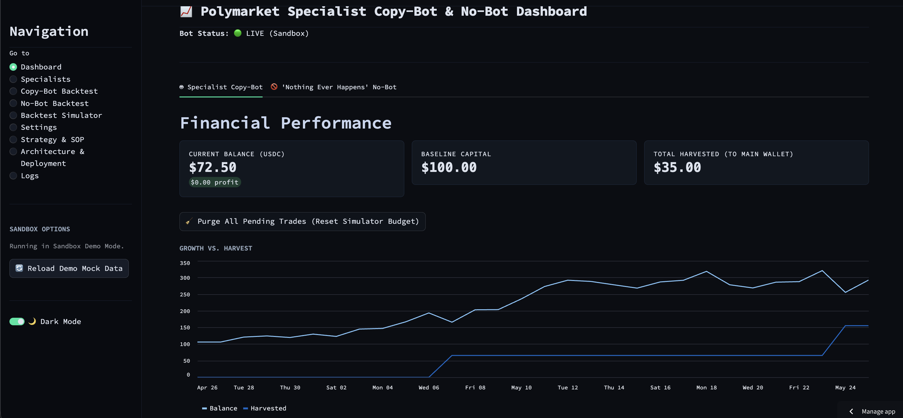
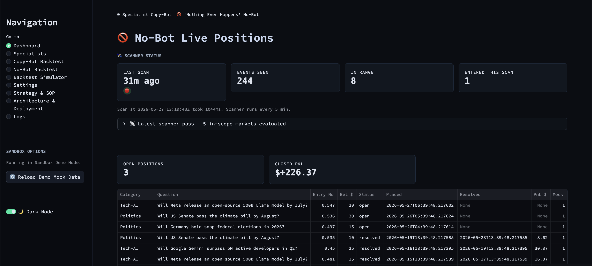
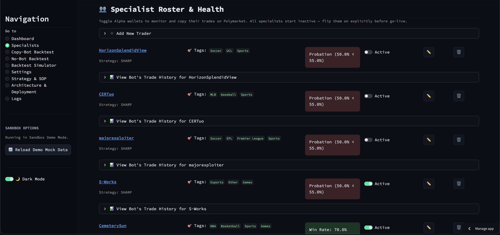
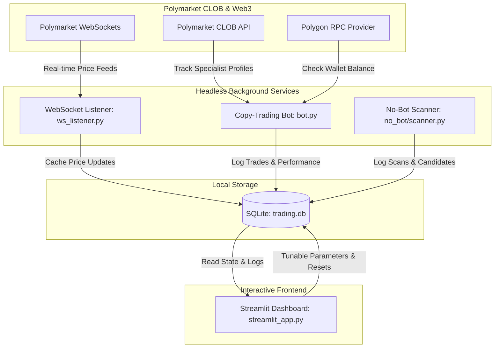

# 📡 Polymarket Picks: Copy-Bot & No-Bot Command Dashboard

View demo app here: [polymarket-picks.streamlit.app](https://polymarket-picks.streamlit.app/)

An automated prediction market trading terminal and strategy sandbox for [Polymarket](https://polymarket.com). Built with Python, Streamlit, and SQLite.

This project implements two core trading strategies:
1. **🤖 Specialist Copy-Trading**: Monitors high-performing "alpha" wallets on Polymarket and replicates their orders using fractional Kelly bet sizing, adaptive value caps, slippage guards, and a profit-harvesting rule.
2. **🚫 'Nothing Ever Happens' No-Bot**: Scans high-volume binary matchup markets in Tech/AI, Politics, and Sports, and automatically enters "No" positions on low-probability/high-premium events.

---

## ⚡ Live Demo (Sandbox Mode)

The dashboard includes a built-in **Sandbox Demo Mode**. If you run the application without a `.env` file (or set the environment variable `DEMO_MODE=true`), the app will automatically seed the local database with 30 days of realistic mock data. 

In Demo Mode:
- Live Web3 queries are safely mocked.
- No real trades or transactions are executed.
- The dashboard is pre-populated with a sample portfolio, balance charts, activity logs, and active positions.
- The **No-Bot Backtest** automatically runs on simulated historical markets if the 100MB markets database is not downloaded.

---

## 🚀 Key Features

### 1. Specialist Copy-Trading Bot
- **Roster Management**: Manage active specialist wallets directly from the UI.
- **Probation Guard**: Automatically puts specialists on probation and skips their trades if their 10-trade win rate falls below a set threshold (e.g. 55% for SHARP, 40% for WHALE).
- **Conviction Sizing**: Adjusts copy bet size based on the specialist's relative allocation size and historical performance.
- **2x profit harvesting**: Automatically sweeps 50% of profits to a personal cold wallet when the trading bankroll doubles.

### 2. No-Bot "Nothing Ever Happens" Scanner
- **Automated Scanner**: Periodically polls the Polymarket CLOB for candidate binary markets.
- **Category Filter**: Focuses on categories with statistically proven edges (Tech-AI, Politics, Sports-Other).
- **Interactive Backtester**: Re-run historical simulations with tunable bankroll, Ceilings, and volume thresholds.

---

## 🖼️ Dashboard Preview

*For open-source deployment, place your screenshots in the `docs/` folder.*

### 📊 Main Command Center
Displays portfolio performance, available USDC balance, total harvested profit, and a dual-tab layout for the copy-trading activity log and the No-Bot scanner status:



### 👥 Specialists Roster
Manage monitored traders, toggle active copy status, view individual win rates, and review past copied trades:


---

## ⚙️ Project Structure

```
polymarket-picks/
├── streamlit_app.py  # Streamlit dashboard UI (all tabs, pages, and interactive backtests)
├── mock_data.py      # Demo Mode database seeder (generates 30 days of trading & balance history)
├── bot.py            # Headless copy-trading executor (polls specialist wallets & checks rules)
├── database.py       # SQLite database wrapper (schema, trades, configs, specialist roster)
├── finance.py        # Kelly sizing algorithms, value caps, and harvest calculations
├── ws_listener.py    # WebSocket client for real-time price monitoring
├── requirements.txt  # Python dependencies
├── Dockerfile        # Container recipe for deployment
├── .env.example      # Sample environment configuration file
└── no_bot/           # Modules for the 'Nothing Ever Happens' scanning engine
```

---

## 🏗️ System Architecture

The following diagram illustrates how the background execution services, database layer, and Streamlit user interface interact with the Polymarket APIs:



---

## 🛠️ Installation & Setup

### Option 1: Local Python Environment

1. **Clone the repository**:
   ```bash
   git clone https://github.com/your-username/polymarket-picks.git
   cd polymarket-picks
   ```

2. **Create a virtual environment & install dependencies**:
   ```bash
   python -m venv .venv
   source .venv/bin/activate      # Windows: .venv\Scripts\activate
   pip install -r requirements.txt
   ```

3. **Run the Dashboard in Demo Mode**:
   ```bash
   streamlit run streamlit_app.py
   ```
   *Since no `.env` file is present yet, the app will launch in **Sandbox Demo Mode** and populate mock data automatically!*

4. **Go Live (Configure Real Trading)**:
   Copy `.env.example` to `.env` and fill in your keys:
   ```bash
   cp .env.example .env
   ```
   *See the [Security & Configuration](#security--configuration) section below before adding real keys.*

---

### Option 2: Docker Setup (Recommended for VPS)

To host the dashboard and run the background copy bot 24/7 on a remote virtual server (VPS):

1. **Build the Docker Image**:
   ```bash
   docker build -t polymarket-picks .
   ```

2. **Run the Container**:
   - **For Demo Mode**:
     ```bash
     docker run -d -p 8501:8501 -e DEMO_MODE=true polymarket-picks
     ```
   - **For Live Mode (with `.env` file)**:
     ```bash
     docker run -d -p 8501:8501 --env-file .env polymarket-picks
     ```

---

## ☁️ Hosted Demo (Streamlit Community Cloud)

You can host a completely free, live interactive demonstration of this dashboard using **Streamlit Community Cloud**.

1. Fork this repository to your GitHub account.
2. Visit [share.streamlit.io](https://share.streamlit.io/) and log in with your GitHub account.
3. Click **New App**, select your forked repository, the `main` branch, and leave the main file path set to the default `streamlit_app.py`.
4. Under **Advanced Settings**, add the environment variable:
   ```env
   DEMO_MODE=true
   ```
5. Click **Deploy**. Your live demo dashboard will be up and running in minutes!

---

## 🔒 Security & Configuration

> [!WARNING]
> **Keep Your Private Keys Safe**
> - **Never** commit your `.env` file, live databases (`trading.db`), or log files to GitHub. The project's `.gitignore` is pre-configured to ignore these files, but always double-check before pushing.
> - **Dedicated Wallet**: Never use your primary personal wallet for live bot trading. Create a new, dedicated hot wallet specifically for the bot.
> - **Capital Buffer**: Keep only a minimal amount of USDC in the bot wallet (e.g. $50–$100 to start). Use the **2x Harvesting Rule** to automatically sweep profits to a secure, separate cold storage address.

### Environment Variable Guide

| Variable | Required For | Description |
|---|---|---|
| `DEMO_MODE` | Sandbox | Set to `true` to force demo mode (mocks all Web3 calls and pre-seeds mock data). |
| `BOT_WALLET_ADDRESS` | Live Display | The public address of your dedicated trading bot wallet. |
| `BOT_PRIVATE_KEY` | Live Execution | The private key of your dedicated bot wallet (required to sign transactions). |
| `HARVEST_WALLET_ADDRESS` | Live Harvesting | The public address where 2x profit harvests will be sent. |
| `ALCHEMY_POLYGON_URL` | Live Balance | Your Polygon RPC URL from Alchemy (to query wallet balances). |
| `TELEGRAM_BOT_TOKEN` | Alerts (Optional) | Bot token from BotFather to receive mobile trade updates. |
| `TELEGRAM_CHAT_ID` | Alerts (Optional) | Your chat ID to receive Telegram messages. |

---

## 🧪 Simulating & Backtesting

### Monte Carlo Simulator
Simulate strategy outcomes over 7 to 365 days across hundreds of scenarios. You can configure:
- Roster mix (number of SHARP vs. WHALE specialists).
- Market conditions (slippage, fees, average entry price).
- Profit harvesting triggers.
Provides equity curves, maximum drawdown profiles, and survival probability charts.

### No-Bot Historical Backtest
Runs a sequential simulation of the "Nothing Ever Happens" strategy on historical markets. 
- In **Demo Mode**, the backtester generates simulated historical markets on the fly so you can test how capital constraint rules behave.
- In **Live Mode**, download the 100MB markets database by running `python backtest/fetch_markets.py` to test against actual Polymarket historical data.

---

## ⚖️ Disclaimer & Terms of Use

This software is for educational and research purposes only. Prediction market trading involves substantial risk of financial loss. Past performance of any specialist wallet is not indicative of future results. Use this software at your own risk.

Before downloading, modifying, or running this codebase, please review the complete [Terms of Use & Disclaimer](TERMS.md) for critical disclosures regarding financial risks, limitation of liability, and geographic compliance.
