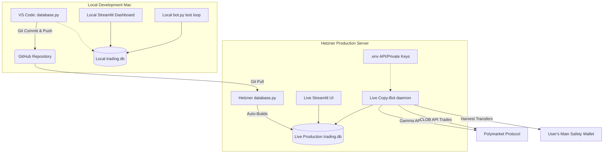

# 🏛️ Polymarket Bot: System Architecture

This outlines the infrastructure and deployment pipeline for running the copy-bot safely across Local (your Macbook) and Remote (Hetzner Cloud) environments.

## Architecture Diagram

## Local vs Remote Workflow (Best Practices)

1. **Total Isolation**. Your Local Mac environment and your Hetzner Production environment operate completely isolated from one another. This is by design. You never want your local test server "subscribing" to your live production database, because hitting `start.sh` on your local laptop could accidentally fire live, real-money duplicate trades!
2. **Updating Traders.** When you want to permanently cement a new trader into your roster, you edit the "defaults" array in `database.py` locally and push to GitHub.
3. **Deploying.** You SSH into your Hetzner server and `git pull`. When you start your bot on Hetzner, the code detects the new python source file and dynamically reconstructs the live `trading.db` from those defaults without losing historical memory.
4. **Environment Variables.** The `.env` file containing your Private Keys, Alchemy endpoints, and Telegram IDs is strictly blocked from Github via `.gitignore`. You must log into Hetzner and type `nano .env` exactly once during initial setup to insert your secret keys. 

## What to do next to go live?
1. Edit `database.py`'s `defaults` array on your Mac to lock in the actual `0x...` hashes over any "MOCK_" placeholders.
2. Ensure you have your `BOT_PRIVATE_KEY` and `ALCHEMY_POLYGON_URL` mapped locally to test it end-to-end.
3. Push everything to your remote Github Repo.
4. Clone the Repo onto your Hetzner VPS.
5. Create `.env` on Hetzner and paste the keys in.
6. Trigger the start script via a screen or daemon!
